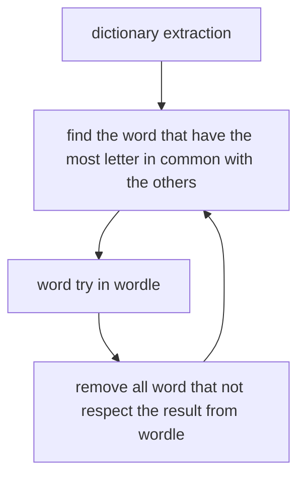

# Yes another Wordle Cracker

I know I supposed there are tone of wordle-cracker. And I know why it is cool to code yours.

So here is mine.

## How to install it

* as requirement you need nodejs (min 13.7) and npm(min 6.14) installed
* clone this repo
* npm install

## Algo

## How to use it

In terminal run `npm run main` or `node index`

You have to follow the questions

When the algo ask for the result from wordle here is the syntax `* * * * *` where * can be :

* 0 letter is not present
* 1 letter is present but not at the right place
* 2 the letter is present and at the right place

## Statistic

basically this algo find the word in three tries

## Supported languages

two languages supported :
* english
* french

## add new language

If someone (let me hope) wants a new language please share me a representative dictionary

## Responsabilities

I am not responsible if this code ruins your game's experience